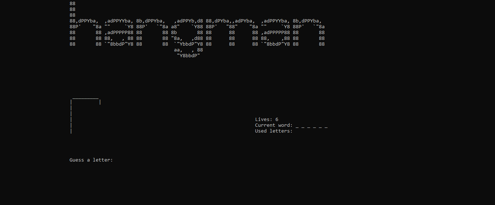

# Basics of C workshop
  
```
Problem: Make a C application in Visual Studio that imports a *.txt file containing a list of words(romanian language), one per line. The application in a random way should
choose one of these words and implement a text-based input type of the Hangman game(Spanzuratoarea), basically you need to guess all the letters in that word one at a time within
a certain number of guesses.
The program should display in a text-based way the current status, the guessed letters with the correct number of occurences and the letters tried but not guessed. In the end
the program should say the conclusion of the game in the end and should have the option either to terminate or to start over.

Suggestion:
 - Follow the project template discussed in the Basics of C presentation
 - Use user types only (make your own types like UInt8, Boolean , etc ) based on your needs, do not use basic data types
 - All new user data types should be explained where defined
 - Make a structured/modular project based on functionality
 - Keep the main() function with minimum number of statements, mainly function calls
 - Within the functions template(header) add informations about Function purpose, usage, parameters and return values if any
 - Make your code easy to read/understand
 - Do not use global variables, use interfaces
 - Make code/RAM optimizations
```
